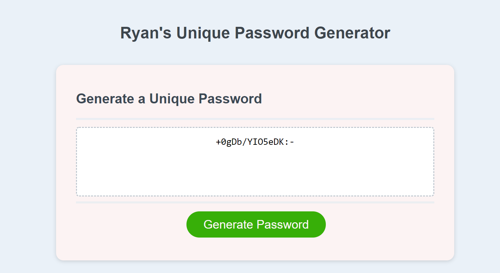

## Ryan's Password Generator

- This is a unique project of mine that has helped me learn more JavaScript, HTML and CSS.
- This project is to help anyone with a unique password!

## Description

Provide a short description explaining the what, why, and how of your project:

Need a unique password for a website login? This app will generate a unique password you can copy and paste into the password field! A password between 8 and 44 characters will be generated and you can select how many characters you would like.

## Installation

What are the steps required to install your project? Clone a copy of this repository from Github to get started!

## Tests

This has been tested on W3C markup validator and no errors or warnings to show.

## ScreenShot

## Credits

Ryan Anderson
